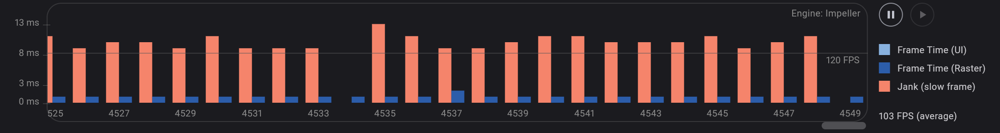
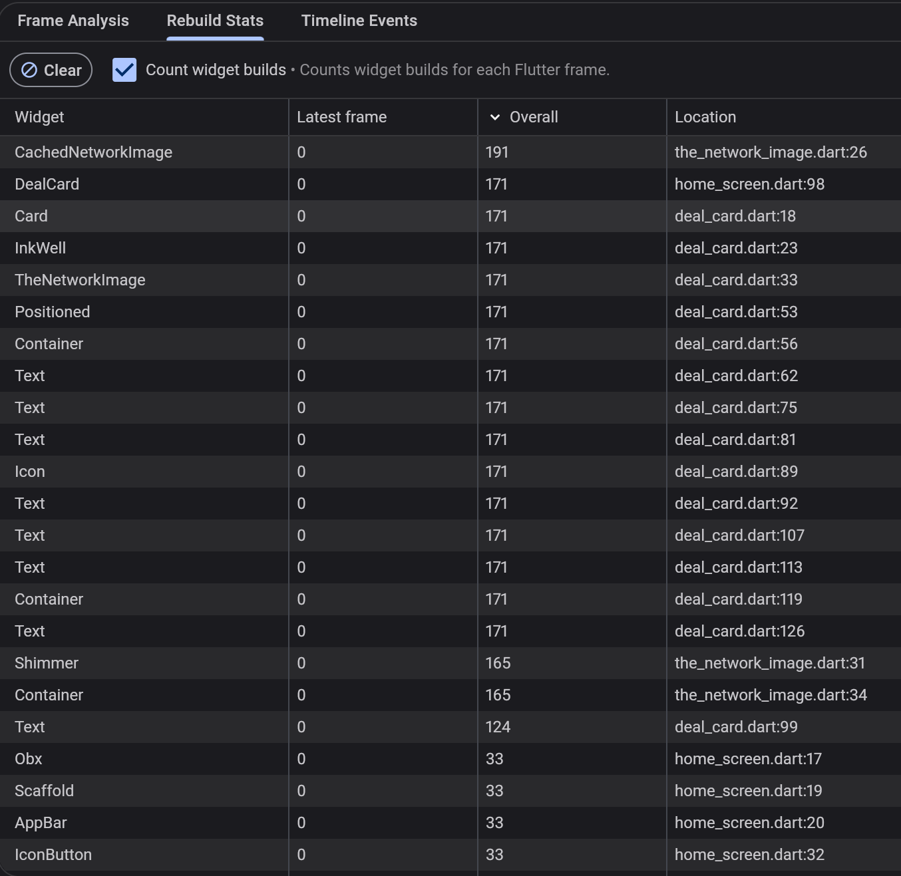
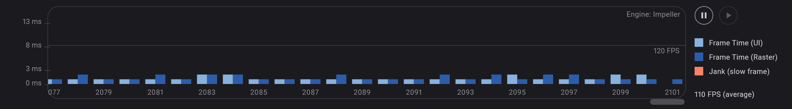
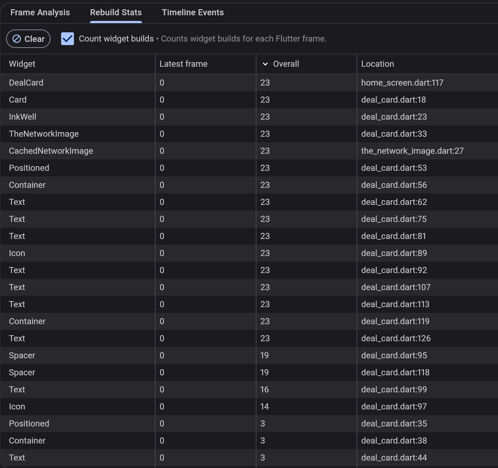

# Rescu — Flutter Developer Assessment

## Part A — Bug tickets

Here are the solutions for each of the problems in the Rescu.

### RES-101 · Search shows results for the wrong query

Type a word quickly in search — for example "sushi", letter by letter.
Frequently the final results do not match what is in the text box: correct
results appear briefly, then get replaced by results for an earlier, shorter
query. Team reproduces this most attempts. Users report "search is drunk".

### RES-101 Solution

**Root cause:**

Continuous spamming of API calls on each letter/ multiple request at once.

**Fix:**

1. Using Debounce to reduce how many requests get fired in the first place (efficiency/UX). Without it, typing "sushi" fires 5 separate API calls (s, su, sus, sush, sushi) as the user types each letter. That's wasteful, hammering your backend for results the user will never even see, since they kept typing past each one.
2. Using SearchId guard to ensure correctness when multiple requests are still in flight at once (correctness/data integrity). And only show the latest search results by comparing the searchId's and discarding the previous result.

I thought to just use the SearchId guard and leave it as is and it would solve the problem but, I didn't leave it at that as the continuous API spamming would cause more performance issue.

The fix didnt take that long as the bug was obvious and was solved under 30 min. Also no AI used for this one.

### RES-102 · Crash after leaving My orders

Open **My orders** while there is an order with an upcoming pickup, then
navigate back. Within a couple of seconds the app crashes in debug builds with
`setState() called after dispose()`.

### RES-102 Solution

**Root cause:**

Timer.periodic in PickupCountdown is created without canceling it, so it continues firing after PickupCountdown is removed when popping out of OrdersScreen and calls setState on a disposed state.

**Fix:**

1. The periodic timer is now stored, canceled in dispose(), and guarded with mounted. If the timer wasn't cancelled it would continue existing even after popping out of the page and give error.

The fix took few min to find that PickupCountdown was using periodic Timer and it wasnt disposed causing the bug and was solved under few minutes. For the use of AI, Copilot suggested to check if it was mounted or not using if statement while initializing.

### RES-103 · Requests pile up the longer you browse

After opening several deal pages, every tap on "Add to bag" triggers a burst
of `GET /deals/:id` requests — one for _each deal viewed earlier in the
session_, even for screens that were closed long ago. The app gets slower
and chattier the longer the session. Watch the console logs while browsing
to see it (every simulated request is logged).

### RES-103 Solution

**Root cause:**

The cause is in onInit of DealDetailsController where each page registers an ever(...) worker on the app-wide cart observable, but the returned Worker is discarded, so closing the page never unregisters that listener.

**Fix:**

1. I disposed the worker in onClose in DealDetailsController. This removes old controllers while preserving the stock refresh for the active page. Each controller now stores its cart listener and disposes it in onClose(), preventing closed deal pages from reacting to future “Add to bag” events.

The fix took me around 30 to 40 minutes as I have never worked with workers before and took me some time to learn what ever, everAll, once and debounce did. The used worker, ever() wasnt disposed causing the bug and was solved under few minutes after found. Researched about the workers rather the use AI to solve this issue.

### RES-104 · Duplicate deals in the home feed

Scroll to the bottom of the home feed so the next page starts loading, then
quickly pull down to refresh while it is still loading. Intermittently the
feed ends up with duplicated cards, or more items than the catalog contains.

### RES-104 Solution

**Root cause:**

I couldn't replicate the problem again by myself, but looking and going through the code, during refresh, an earlier loadMore() request could finish afterward and append its results to the newly refreshed list, causing duplicates or excess items. While refreshDeals() can modify the list during that request, loadMore() modifies the shared pagination state before its request is finished.

**Fix:**

The fix will discarding ongoing pagination results when a refresh starts, prevent a new load during refresh, and update \_page only for the response that still belongs to the current feed generation.

1. Discarding outdated pagination responses at the start of the refresh.
2. Blocking loadMore() while refresh is active.
3. Committing \_page only after the matching request succeeds.
4. Keeping pagination state consistent after failures.

The fix took me longer than I expected as I couldn't recreate the issue and took me some time to go through the code. After understanding the code, it took me around an hour to fix everything. I used copilot to understand the code to solve this issue.

### RES-105 · Home feed is janky and memory keeps climbing

On mid-range Android devices the home feed drops frames noticeably while
scrolling, and memory grows the further you scroll until the OS kills the app.
DevTools shows the entire feed rebuilding continuously during scroll, and the
image cache ballooning. There is more than one contributing cause — we expect
you to find and explain them, with before/after evidence from DevTools
(screenshots or numbers in `solutions.md`).

### RES-105 Solution

**Root cause:**

1. HomeScreen wraps the entire Scaffold in Obx while reading scrollOffset, so every scroll tick rebuilds the full feed.
2. The feed uses ListView(children: [...visibleDeals.map(...)]), which eagerly creates the whole catalog instead of lazily building visible cards.
3. The image widget also gives CachedNetworkImage no decode size bounds, so large source images can occupy much more memory than their 160 px display size.

**Fix:**

1. scrollOffset previously wrapped the entire Scaffold in Obx, rebuilding the complete feed on every scroll tick. scrollOffset is now replaced by showScrollToTop for FAB and isScrolled for appbar. It now only rebuilds the appbar and FAB when necessary instead of in every scroll as Obx is only used where necessary.
2. The feed used ListView(children: [...]), eagerly creating every deal card. It now uses ListView.builder, creating only nearby cards. The DealCard is now wrapped with RepaintBoundary to isolates each card's repaints so scrolling one doesn't force repaints of other cards.
3. Images now use memCacheHeight, preventing oversized source images from consuming excessive decoded-image memory.

**Before**

**After**

Both before and after images were captured on a single swipe in the homepage till the pagination and sorted by Overall rebuilds. We can see that there is significant improvement on performance with FPS increase after the fix resulting in a smoother scroll in homepage.

The fix took me 1-2 hours. I used Claude to get info on widget rebuilds when using Obx and got suggested to use RepaintBoundary to isolates each card's repaints so scrolling one doesn't force repaints of other cards. Other fixes were done by myself but got auto complete from copiliot at some places.

### RES-106 · Wrong pickup times; "Pickup today" filter misses deals

Multiple user complaints: a bakery that opens **06:00–09:30** shows
"Pick up 23:00 – 02:30" on its cards, and several stores with pickup slots
today never appear when the **Pickup today** filter is on. Some users showed
up at closed stores. The backend team insists their data is correct and
points out the API sends standard ISO-8601 UTC instants, like every API we
integrate with.

### RES-106 Solution

**Root cause:**

1. I tried to find the bakery open time to fix the issue for pickup time but couldnt find it. It is given that the backend send the data in standard UTC format but the datetime in PickupWindowModel is never converted to local time which may have been causing the issue.
2. Also start datetime was compared with current datetime in isToday and that will filter out based on the time as well in PickupWindowModel.

**Fix:**

1. Converted the UTC time to local time in PickupWindowModel for start and end date, so that the timing for pickup is accurate in the app. Also since all the datetime is sent in UTC format from the backend, all the incomming datetime was converted to local for consistency.
2. Compared start date and current date excluding time to make sure isToday is valid.

I fixed this issue within an hour. It took few minutes to find all the incomming datetime and change them to local as well. didnt need to use AI for this one, just used copilot to check if there were more date issues.

### RES-107 · Deep link opens to a crash

Marketing sends push notifications that deep-link to deals, e.g.
`rescu://open/deal?id=42&source=push`. Opening such a link crashes with
`type 'Null' is not a subtype of type 'DealModel'`. Opening the same deal
from the home feed works fine.

Repro options:

- In-app: Home → overflow menu (⋮) → **Simulate deep link…**
- Android: `adb shell am start -a android.intent.action.VIEW -d "rescu://open/deal?id=42&source=push" dev.rescu.rescu`

Requirement: the link must land the user on a fully working deal page (deal
42 exists in the catalog). Showing an error/fallback screen instead is not an
acceptable resolution for this ticket.

### RES-107 Solution

**Root cause:**

Home navigation passed a DealModel through arguments, but deep links only provided the id as 42. The controller then cast Get.arguments directly to DealModel, causing the null type error.

**Fix:**

1. Read the deal ID from Get.parameters.
2. Fetch the deal with DealRepo.fetchById in \_loadDeal() in DealDetailsController.
3. Show a loading state while fetching in the DealDetailsScreen.
4. Show an error state if the deal ID is invalid or unavailable.

I fixed this issue an about an hour. It took some time to check the passed parameters and the missing ones.

Used Copilot to clean the code and to check if there were more issues regarding deeplinking.

---

## Part B — Features

### F-1 · Live flash-sale countdowns

Flash deals (`flashSaleEndsAt` on the model) currently show a static
"Ends soon" badge. Replace it with a **live countdown** (`mm:ss`, or
`hh:mm:ss` above an hour) everywhere the deal appears: flash rail, home feed
cards, and the details screen.

Requirements:

- When a countdown reaches zero: the card switches to a disabled "Expired"
  state, the deal can no longer be added to the bag, and if it is already in
  the bag it is removed with a visible notice.
- The home feed must stay smooth with 100+ visible countdowns. We will
  profile your implementation with DevTools; per-second rebuilds must be
  scoped to the text that actually changes — not whole cards, not the whole
  list.

**Whats Done:**

1. The countdown badge/container is built for all the deal cards, flash cards and detail page.
2. Each second only the changing countdown Text is rebuilt for performance. And timers are still canceled when their text widgets are disposed.
3. Popup snackbar shown on deal expire stating the removal of the item from the bag. And deals already in the bag are automatically removed when their sale expires.
4. Expired deals cannot be added to the bag.
5. Expiry timers are canceled when items are removed, cleared, or the service closes.

### F-2 · Impression tracking

Product wants view analytics on deal cards. Using `AnalyticsService`:

- Log a `deal_impression` event when a deal card has been **≥50% visible for
  at least 1 continuous second**. Properties: `deal_id`, `source`
  (`home_feed`, `flash_rail`, or `search`), `position` (index in its list).
- At most **once per deal per app session**, across all screens.
- Do not send events one by one: batch them and deliver via
  `FakeApiService.sendAnalyticsBatch` when either 10 events have accumulated
  or 15 seconds have passed since the first unsent event — whichever comes
  first.
- Scrolling performance must not regress.
- The `visibility_detector` package is already in `pubspec.yaml`; using it is
  allowed but not required.

Verify your events on the **Analytics debug** screen (Home → ⋮ → Analytics
debug).

**Whats Done:**

Implemented deal impression analytics where:

1. Tracks a deal after it remains at least 50% visible for 1 continuous second.
2. Supports home_feed, flash_rail, and search sources.
3. Includes deal_id, source, and list position.
4. Deduplicates once per deal for the entire app session.
5. Batches events and sends them through sendAnalyticsBatch:

- At 10 events, or
- 15 seconds after the first pending event.

6. Used `FakeApiService.sendAnalyticsBatch` to send the analytics data via analytic_service.dart.
7. Changed some widgets to follow DRY concept for better performance

Used AI for this one to figure out the logic to save the data. Took me around 4 hrs.

### F-3 · Stock reservations with optimistic UI

Right now the bag is purely local, so two users can "add" the last bag and
one of them finds out only at pickup. The backend already exposes
reservations (see `FakeApiService.reserveDeal` / `releaseReservation`, and
`reservationId` on checkout): a reservation holds stock for **5 minutes** and
intermittently fails with a 409 when stock is contended.

Build reservation support into the bag:

- Adding to the bag reserves stock. The UI must respond **optimistically**
  (instant feedback), then reconcile: if the reservation fails, the item is
  rolled back out of the bag with a clear, non-technical message.
- Each bag line shows how long its reservation has left.
- Removing a line (or reducing quantity) releases/adjusts the hold.
- Checkout passes reservation ids; handle the `410 reservation expired`
  rejection gracefully.
- **Deliberately underspecified:** what should happen when a reservation
  expires while the user is still in the app (or mid-checkout)? Decide the
  product behaviour yourself, implement it, and justify the decision in
  `solutions.md`. There is no single right answer — there are wrong ones.

**Whats Done:**

1. Cart lines are added immediately with a `Securing item...` state while a reservation request runs. A failed initial reservation removes the line and explains that the item is no longer available.
2. Quantity increases and decreases reserve the new quantity before releasing the previous hold. If the new hold fails, the previous quantity and hold are restored.
3. Each confirmed line displays the remaining 5 minute reservation time. Removing, reducing to zero, clearing, and successful checkout release the related reservation.
4. Checkout is blocked while a reservation is pending. A server `410` removes expired lines and asks the user to add them again, rather than showing a technical API error.
5. If a reservation expires while the user remains in the app, the line is removed immediately and a visible notice explains why. This avoids showing stock the user no longer owns and prevents a predictable checkout failure. The same rule handles a hold expiring during checkout: the server response is reconciled by removing the expired line and leaving any other valid lines available for a fresh attempt.

While working on it, I found, the quantity is being refreshed from the backend, but this fake reservation API does not reduce the catalog’s quantityLeft when a hold is created. The details controller therefore keeps showing the original stock. I thought to sync the quantity with the card quantity as recommended by AI but didnt do it as it doesnt match a real production app, rather just a temporary fix.

I Used AI for this one as well to figure out the quantity issue. Took me around 4 hrs to understand the code and integrate the feature.

---

## Part C — Written deliverables

Q1: In this codebase, what is the difference between a `GetxController`'s
lifecycle and a widget `State`'s lifecycle? Name one bug from Part A
that exists because of confusion between the two.

**ANS:** A GetxController follows GetX dependency/route lifecycle:

- onInit() runs when GetX creates the controller.
- onClose() runs when GetX disposes it.
- Its lifetime can outlast a particular widget rebuild and depends on route/dependency management.

A widget State follows the Flutter widget-tree lifecycle:

- initState() runs when the state is mounted.
- dispose() runs when the widget leaves the tree.
- setState() is only valid while that state is mounted.

One Part A bug was RES-102: PickupCountdown created a Timer.periodic in initState() but did not cancel it in dispose(). After leaving the orders screen, the timer continued calling setState() on the disposed widget, causing setState() called after dispose().

A related controller-lifecycle bug was RES-103, where a GetX ever() worker was not disposed in DealDetailsController.onClose().

Q2: When does wrapping a large subtree in a single `Obx` hurt you? How do you decide how tightly to scope reactivity?

**ANS:** Wrapping a large subtree in one Obx hurts when any observed value changes, because the entire subtree rebuilds, even if only a small child depends on that value. This increases build work, can cause dropped frames during high-frequency updates such as scrolling or countdown timers, and may recreate expensive lists, images, or layout trees unnecessarily.

I scope reactivity around the smallest widget that needs the observable:

- Put feed data and filter state around the list body.
- Put scroll state only around the app bar shadow or scroll-to-top button.
- Put countdown state only around the changing countdown text.
- Keep static cards and expensive child widgets outside unrelated Obx builders.

The tradeoff is readability versus rebuild cost. I start with the narrowest meaningful boundary, then use DevTools’ rebuild trackings.

Q3: How would you write an automated test that would have caught
RES-106 before release? What (if anything) would you change in the code
to make such a test possible?

**ANS:** I would test the timezone conversion and date filtering at the model/controller boundary.

For example, freeze the clock at a known instant, parse an API payload containing UTC timestamps, and assert that:

- PickupWindowModel.label formats the correct local time.
- isToday is true when the pickup instant falls on the device’s local calendar date.
- A timestamp with the same day number but a different month or year returns false.
- isOpenNow compares local instants correctly.

Then I would test HomeController.visibleDeals with todayOnly = true, using deals whose UTC pickup windows cross a local midnight boundary, and assert that only the correct local-date deals remain.

To make this predictable, I would inject a now function into PickupWindowModel and the controller instead of calling DateTime.now() directly. I would also centralize parsing in a helper such as parseApiDateTime(value).toLocal(). Tests could then provide a fixed clock and avoid depending on the machine’s timezone or current date.

---

I spent around 3 days in this entire project and if I could spend a day more, I would go through the F-3 feature again and if I could modify the backend, would fix the quantityLeft after reserving the deal which would give me an opportutity to fix the entire feature. Also would be far easier to use postman to view the datas rather than in code.
